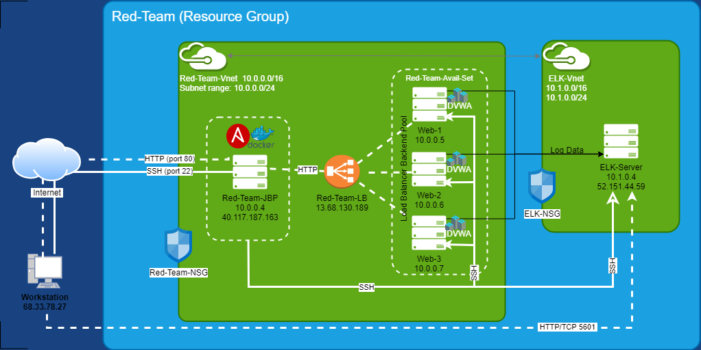
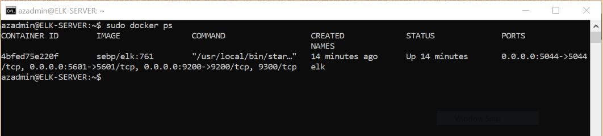

# Automated ELK Stack Deployment

The files in this repository have been tested and used to configure the network depicted below and generate a live ELK deployment on Azure.  The main purpose of this network is to expose a load-balanced and monitored instance of DVWA, the D*mn Vulnerable Web Application.  The files can be used to either recreate this entire network deployment, or only certain pieces of it, such as Filebeat.

This document contains the following details:
- Network Diagram
- Description of the Topology
- Access Policies
- ELK Configuration
  - Beats in Use
  - Machines Being Monitored
- How to Use the Ansible Build

## Network Diagram

## Description of the Topology

**Red-Team-JBP (Jumpbox)**  
Acts as a gateway router that is exposed to the public internet. It sits in front of all other machines that are not exposed to the internet. Directing all traffic through this one node drastically reduces the attack surface. We can implement strong access controls to this single machine, instead of on every VM.

**Red-Team-LB (Load Balancer)**  
Helps distribute traffic evenly and ensures the application will be highly available, in addition to restricting inbound access to the network. The Health Probe function checks all machines are working properly before traffic is sent.

**ELK-Server (Elasticsearch, Logstash, Kibana)**  
Integrating an ELK server allows us to easily monitor the vulnerable VMs for changes to the file systems of the VMs on the network and system metrics.

**Web-1   Web-2   Web-3  (Virtual Web Servers)**  
We have three web servers for redundancy so if one is not working there are two others availble.

**Red-Team-Avail-Set (Availability Set)**  
The web servers are part of an Availability Set, a fault-tolerant group of VMs. Multiple servers are often used to make the website more resilient.

**Red-Team-Vnet and  ELK-Vnet  (Virtual Networks)**  
Peer-to-peer network connections (peerings) are configured between the two Vnets, so they essentially operate as one, and traffic is allowed between all machines. A virtual network is a collection of virtual machines that can communicate with each other.

**Red-Team-NSG  ELK-nsg (Network Security Groups)**  
Basic Firewalls which protect the Virtual Networks. Used to block and allow traffic to our virtual network and between machines on the network.

The configuration details of each machine within the virtual networks may be found below.

| Name         | Function   | IP Address | Operating System |
|--------------|------------|------------|------------------|
| Red-Team-JBP | Gateway    | 10.0.0.4   | Linux            |
| Web-1        | Web Server | 10.0.0.5   | Linux            |
| Web-2        | Web Server | 10.0.0.6   | Linux            |
| Web-3        | Web Server | 10.0.0.7   | Linux            |
| ELK-Server   | Monitoring | 10.1.0.4   | Linux            |

## Access Policies

The machines on the internal network are not exposed to the public Internet.

Only the Jumpbox machine can accept connections from the Internet. Access to this machine is only allowed from the IP address of the external Workstation:  68.33.78.27

Machines within the networks can only be accessed by each other.

Access to the ELK VM is allowed from the IP address: 68.33.78.27

A summary of the access policies in place can be found in the table below.

| Name         | Publicly Accessible | Allowed IP Addresses |
|--------------|---------------------|----------------------|
| Red-Team-JBP | Yes                 | 68.33.78.27          |
| Web-1        | No                  | 10.0.0.1-254         |
| Web-2        | No                  | 10.0.0.1-254         |
| Web-3        | No                  | 10.0.0.1-254         |
| ELK-Server   | Yes                 | 68.33.78.27          |

## Elk Configuration

Ansible was used to automate configuration of the ELK machine. No configuration was performed manually, which is advantageous because it can be replicated easily.

The playbook [install_elk.yml](Ansible/install_elk.yml) implements the following tasks:
- Install docker
- Install python3
- Increase virtual memory
- Download and launch a docker elk container
- Enable service docker on boot

The following screenshot displays the result of running `docker ps` after successfully configuring the ELK instance.

### Beats in Use
We have installed the following Beats on these machines:
- **Filebeat** with playbook [install_filebeat.yml](Ansible/install_filebeat.yml)
- **Metricbeat** with playbook [install_metricbeat.yml](Ansible/install_metricbeat.yml)

These Beats allow us to collect the following information from each machine:
- Filebeat monitors log events, such as which files have changed and when, for example records changed in /etc/passwd.
- Metricbeat records the machines metrics such as CPU usage, for example usage too high.

### Machines Being Monitored
This ELK server is configured to monitor the following machines:
-  10.0.0.5
-  10.0.0.6
-  10.0.0.7

## How to Use the Ansible Build
In order to use the playbook, you will need to have an Ansible control node already configured. Assuming you have such a control node provisioned:

SSH into the control node and follow the steps below:
- Copy the playbook "install_elk" to /etc/ansible/
- Update the hosts file with IP address of each VM to run the playbook on.
- Run the playbook and navigate to http://[your.Elk.VM.IP]:5601/app/kibana from your browser to check that the installation worked as expected.
